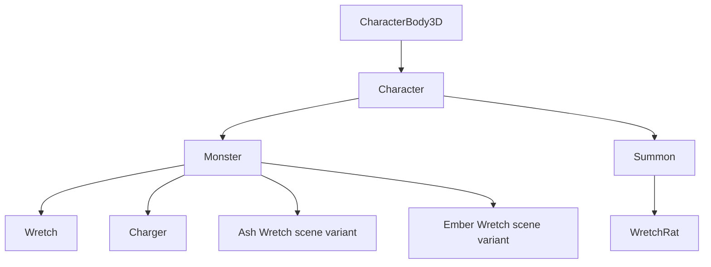
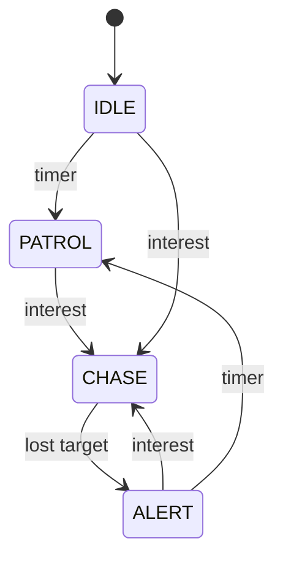
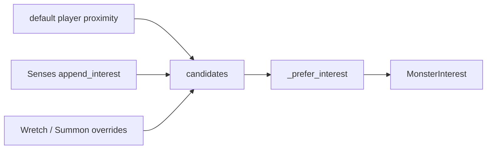
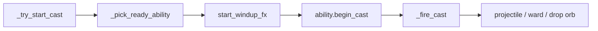
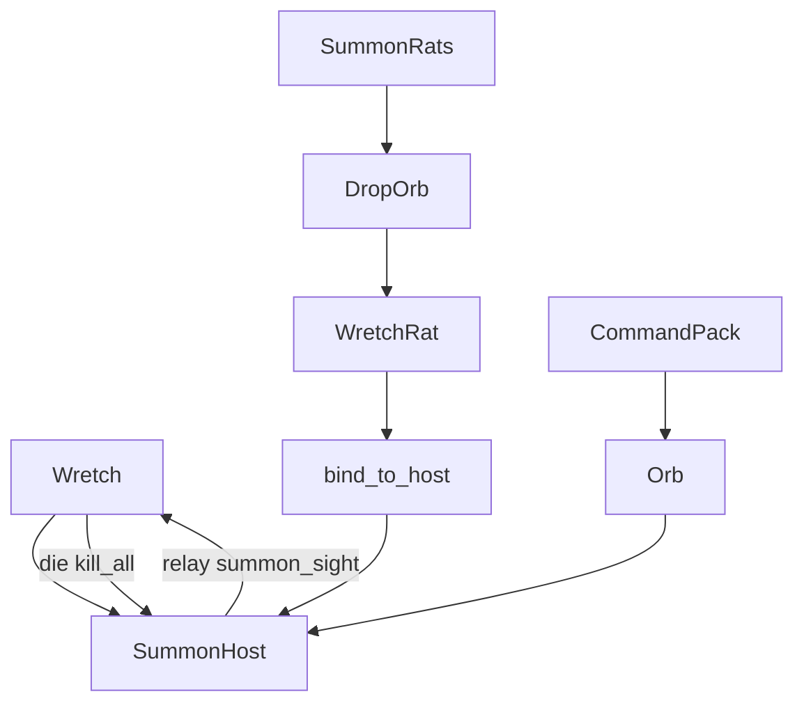
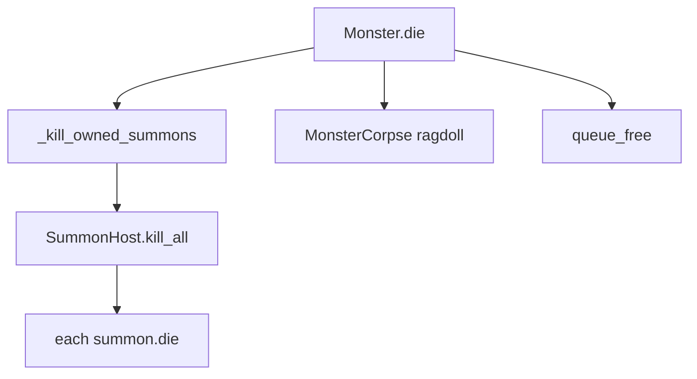

# Monster structure

Developer map of how combat monsters are wired today: class hierarchy, scene ownership, AI, abilities, and Wretch summons.

Documented **as-is**. Ash / Ember are scene variants of `Monster` (no subclasses). Summons use their own `Character` → `Summon` base (not `Monster`).

---

## Roster

| Type | Scene | Script | Kit / behavior |
|------|-------|--------|----------------|
| **Wretch** | [scenes/monsters/wretch.tscn](../../scenes/monsters/wretch.tscn) | [wretch.gd](../../scripts/monsters/wretch.gd) | Summon Rats + Command Pack; `KEEP_AWAY` @ 20 m; Sight + Hearing |
| **Ash Wretch** | [scenes/monsters/ash_wretch.tscn](../../scenes/monsters/ash_wretch.tscn) | base [monster.gd](../../scripts/monsters/monster.gd) | Ice Bolt + Ash Ward; `CLOSE_IN` |
| **Ember Wretch** | [scenes/monsters/ember_wretch.tscn](../../scenes/monsters/ember_wretch.tscn) | base [monster.gd](../../scripts/monsters/monster.gd) | Ember Lob + Ember Halo; `CLOSE_IN` |
| **Charger** | [scenes/monsters/charger.tscn](../../scenes/monsters/charger.tscn) | [charger.gd](../../scripts/monsters/charger.gd) | Facing-cone ram + held ward; `CLOSE_IN` |
| **Wretch Rat** | [scenes/monsters/wretch_rat.tscn](../../scenes/monsters/wretch_rat.tscn) | [wretch_rat.gd](../../scripts/monsters/wretch_rat.gd) | Explode on contact; Sight only; no `Abilities/` |

Shared shells: [scenes/monsters/monster.tscn](../../scenes/monsters/monster.tscn), [scenes/summons/summon.tscn](../../scenes/summons/summon.tscn). Lookdev gallery: [monster_workspace.tscn](../../scenes/monsters/monster_workspace.tscn).

| Type | HP | Speed | Chase range | Notes |
|------|----|-------|-------------|-------|
| Wretch | 50 | 3.2 | 2.5 | No default proximity aggro; senses + rat relay |
| Ash | 55 | 2.8 | 11 | Grey tint |
| Ember | 45 | 3.6 | 14 | Orange/red tint |
| Charger | 60 | 3.0 | 3.0 | Green; ram at 2× player sprint |
| Rat | 10 | 4.4 | 10 | Leashed to host |

---

## Class hierarchy



| Class | File | Role |
|-------|------|------|
| `Character` | [scripts/characters/character.gd](../../scripts/characters/character.gd) | Shared body / locomotion base |
| `Monster` | [scripts/monsters/monster.gd](../../scripts/monsters/monster.gd) | AI loop, cast windup, chase move, death |
| `Wretch` | [scripts/monsters/wretch.gd](../../scripts/monsters/wretch.gd) | Packmaster interest + ability pick overrides |
| `Charger` | [scripts/monsters/charger.gd](../../scripts/monsters/charger.gd) | Sight-cone ram, held ward, maze launch |
| `Summon` | [scripts/monsters/summon.gd](../../scripts/monsters/summon.gd) | Host bind, leash, aggro modes, sense relay (no cast/kite) |
| `WretchRat` | [scripts/monsters/wretch_rat.gd](../../scripts/monsters/wretch_rat.gd) | Explode + fireball-instant-kill |

**RefCounted helpers** (not scene nodes):

| Helper | File |
|--------|------|
| `MonsterAI` | [monster_ai.gd](../../scripts/monsters/monster_ai.gd) |
| `MonsterInterest` | [monster_interest.gd](../../scripts/monsters/monster_interest.gd) |
| `MonsterChaseMove` | [monster_chase_move.gd](../../scripts/monsters/monster_chase_move.gd) |
| `MonsterCombatSpacing` | [monster_combat_spacing.gd](../../scripts/monsters/monster_combat_spacing.gd) |
| `MonsterRangeGizmos` | [monster_range_gizmos.gd](../../scripts/monsters/monster_range_gizmos.gd) |
| `ChargerLaunch` | [charger_launch.gd](../../scripts/monsters/charger_launch.gd) |

---

## Scene-tree ownership

Prefer authored children over invisible script-only wiring.

### Shared shell (`monster.tscn`)

```
Monster (Character + monster.gd)
├── Body / Eyes
└── Senses/          # empty by default; add Sight / Hearing children
```

### Casters (Ash / Ember)

```
*Wretch (Monster)
├── Body/Hands/{RightHand, LeftHand}   # %unique for cast FX
└── Abilities/
    ├── <AbilityA>   # MonsterAbility child
    └── <AbilityB>
```

### Wretch

```
Wretch (wretch.gd)
├── MidBody/Hands/{RightHand, LeftHand}
├── Senses/{Sight, Hearing}
├── SummonHost          # max_summons = 3
├── Ritual              # WretchRitualPose
└── Abilities/
    ├── SummonRats      # requires_target = false
    └── CommandPack     # requires_target = false; hearing aim OK
```

### Wretch Rat

```
WretchRat (Summon → wretch_rat)
├── Body/ExplodeLight
└── Senses/Sight
```

### Charger

```
Charger (charger.gd)
├── CollisionShape3D + MidBody/Neck/Head/Snout/leg colliders  # direct children of the body
├── Body/{LeftHindleg, RightHindleg}   # elongated haunch
├── MidBody/{Neck, LeftForeleg, RightForeleg}
├── Head/{Snout, LeftHorn, RightHorn, StunStars}
├── ShieldHold
├── Senses/{Sight, Hearing}
└── Abilities/ChargeWard
```

---

## AI state machine

Owned by `Monster._physics_process`. States live in `MonsterAI.State`.



Eyes light up in `CHASE` / `ALERT`. Facing uses `face_turn_speed_rad` (default 10 rad/s).

### Interest pipeline



- **Most monsters:** default proximity inside `chase_range` (`source=&"player"`) plus any sense children.
- **Wretch:** no default proximity. Uses Sight, Hearing, summon sight relay (`&"summon_sight"`). Remembers last-known player position for lost-contact Command Pack.
- **Summon / Rat:** forced hunt / investigate override; otherwise senses (rat is sight-only). Relays seen players (`summon_sight` ~2.25) and hearing (`summon_hearing` ~1.85) to the host. Host calm (IDLE/PATROL) runs `begin_recall` — rats return to the host, then spread into leashed search with chase eyes off.

Interest sources in play: `player`, `sight`, `hearing`, `summon_sight`, `summon_hearing`, `last_known`, `forced_hunt`, `forced_investigate`.

### Chase locomotion

| Who | Behavior |
|-----|----------|
| Monster / Ash / Ember | Continuous chase-move timer: wait near optimal range → strafe or retreat (face player while strafing). Retreat capped at `0.8 * chase_range`. |
| Wretch | Continuous loop **off**. KEEP_AWAY spacing at `keep_away_range`. After lost-contact Command Pack → **ALERT**. |
| Ranged CLOSE_IN | Cast-band hold via `MonsterCombatSpacing` when abilities have `min_cast_range > 0.5`. |

---

## Cast pipeline

Abilities are authored under `Abilities/`. Base contract: [monster_ability.gd](../../scripts/monsters/monster_ability.gd).



1. While not casting, `_try_start_cast` round-robins ready `Abilities/` children (`can_cast` + range / no-target rules).
2. Windup stops movement and plays hand / ritual FX.
3. `begin_cast` starts cooldown and calls `_fire_cast`.
4. `_on_ability_cast_fired` hook (Wretch uses this for post-Command reposition).

**Wretch pick overrides:**

- **ALERT:** prefer Summon Rats until pack is full.
- **Lost contact (last known):** charge Command Pack at that point, then enter ALERT.
- **Hearing-only interest:** Command Pack with pending aim (shorter windup path).

---

## Kits

### Ember Wretch

| Ability | ID | CD / windup | Cast band | Effect |
|---------|----|-------------|-----------|--------|
| Ember Lob | `ember_lob` | 5.5 s / 0.55 s | 3.5–13 m | Arc then dive; **20** damage + fireball knockback; ward-blockable |
| Ember Halo | `ember_halo` | 7 s / 0.6 s | 2.5–11 m | Expanding ring; player knockback ×0.35 + brief slow; **no HP damage** |

Scripts: [ember_lob_ability.gd](../../scripts/monsters/abilities/ember_lob_ability.gd), [ember_halo_ability.gd](../../scripts/monsters/abilities/ember_halo_ability.gd). Projectiles under [scenes/monsters/abilities/](../../scenes/monsters/abilities/).

### Ash Wretch

| Ability | ID | CD / windup | Cast band | Effect |
|---------|----|-------------|-----------|--------|
| Ice Bolt | `ash_ice` | 6 s / 0.5 s | 3–14 m | Burst of **2** bolts (0.5 s apart); **14** damage + knockback each |
| Ash Ward | `ash_ward` | 7 s / 0.45 s | needs chase target | Spawns player-style ward for **3** s |

Scripts: [ash_ice_ability.gd](../../scripts/monsters/abilities/ash_ice_ability.gd), [ash_ward_ability.gd](../../scripts/monsters/abilities/ash_ward_ability.gd).

### Charger

Sight-only ram. No default proximity aggro. Poor hearing (1.8 m); a 24 m facing cone with LOS starts the attack.

1. Turn to face the seen player.
2. Wind up **1.2 s** while tinting green → red. Casts a held ward onto `ShieldHold` (**80** HP = **4** fireballs); the dome tints red as HP drops.
3. Ram at **2× player sprint**, locked direction.
4. Slide hits on the per-part body shapes (haunch, shoulders, neck, head, snout, legs) launch every rammed player into a random open maze cell **≥ 2** away (never walls / out of maze). Players stay stunned until **1.5 s after landing**.
5. Charge ends on a wall: ward shatters, Charger is stunned **3 s** with orbiting stars.

| Ability | ID | Effect |
|---------|----|--------|
| Charge Ward | `charger_ward` | Held ward from windup; **80** HP (4 fireballs); red as it weakens; shatters on wall |

Scripts: [charger.gd](../../scripts/monsters/charger.gd), [charger_ward_ability.gd](../../scripts/monsters/abilities/charger_ward_ability.gd), [charger_launch.gd](../../scripts/monsters/charger_launch.gd). Stun overlay lives on `PlayableCharacter/Stun`.

### Wretch (packmaster)

| Ability | ID | CD / windup | Effect |
|---------|----|-------------|--------|
| Summon Rats | `summon_rats` | ambient 20 s / chase **2** s via Wretch; windup 0.55 s | Drop orb → spawn rat; max **3** via `SummonHost` |
| Command Pack | `command_pack` | 8 s / 1.0 s | Fired when contact is lost (or hearing aim): linear orb at last-known; then host → **ALERT**. Hit → `command_attack`; miss → `command_investigate` + rat explore. |

KEEP_AWAY is locomotion (`ChaseStyle.KEEP_AWAY` + combat spacing), not an ability node.

### Wretch Rat

No ability nodes. While `CHASE` and in attack range → charge (~0.34 s) → explode. Splash: player knockback; other monsters **8** damage in ~0.55 m. Player fireball knockback → immediate `die()` (no explode chain). While the host is **ALERT**, rats agitate (short idle, faster scurry) toward the heard sound, still leashed. After a Command Pack land/miss, rats run to the site then explore around it in different directions.

---

## Summons and commands



| Piece | File | Role |
|-------|------|------|
| `SummonHost` | [summon_host.gd](../../scripts/monsters/summon_host.gd) | `can_spawn`, register, `kill_all`, `command_attack`, `command_investigate`, interest relay |
| Drop orb | [wretch_summon_drop_orb.gd](../../scripts/monsters/abilities/wretch_summon_drop_orb.gd) | Land FX then instantiate rat |
| Command orb | [wretch_command_orb_projectile.gd](../../scripts/monsters/abilities/wretch_command_orb_projectile.gd) | Hit player or investigate position |
| Leash | `Summon` | Patrol outer leash ring; soft clamp; freed on forced hunt/investigate |

`bind_to_host(host, leash)` wires `host.tree_exiting` → summon `die()`. Forced hunt disables leash until cleared (`clear_forced_hunt` exists; return-to-leash wiring is thin today).

---

## Death and groups

Runtime groups on `Monster._ready`: `"monster"` and `"combat_target"`. Removed on `die()`.



Any host with a `SummonHost` child gets pack wipe on death. Bound summons also die if the host exits the tree.

---

## Key file index

### Hierarchy and scenes

| Path |
|------|
| [scripts/monsters/monster.gd](../../scripts/monsters/monster.gd) |
| [scripts/monsters/wretch.gd](../../scripts/monsters/wretch.gd) |
| [scripts/monsters/summon.gd](../../scripts/monsters/summon.gd) |
| [scenes/summons/summon.tscn](../../scenes/summons/summon.tscn) |
| [scripts/monsters/wretch_rat.gd](../../scripts/monsters/wretch_rat.gd) |
| [scripts/monsters/summon_host.gd](../../scripts/monsters/summon_host.gd) |
| [scenes/monsters/monster.tscn](../../scenes/monsters/monster.tscn) |
| [scenes/monsters/wretch.tscn](../../scenes/monsters/wretch.tscn) |
| [scenes/monsters/ash_wretch.tscn](../../scenes/monsters/ash_wretch.tscn) |
| [scenes/monsters/ember_wretch.tscn](../../scenes/monsters/ember_wretch.tscn) |
| [scenes/monsters/charger.tscn](../../scenes/monsters/charger.tscn) |
| [scenes/monsters/wretch_rat.tscn](../../scenes/monsters/wretch_rat.tscn) |

### AI / senses

| Path |
|------|
| [monster_ai.gd](../../scripts/monsters/monster_ai.gd) |
| [monster_interest.gd](../../scripts/monsters/monster_interest.gd) |
| [monster_chase_move.gd](../../scripts/monsters/monster_chase_move.gd) |
| [monster_combat_spacing.gd](../../scripts/monsters/monster_combat_spacing.gd) |
| [monster_sight_sense.gd](../../scripts/monsters/monster_sight_sense.gd) |
| [monster_hearing_sense.gd](../../scripts/monsters/monster_hearing_sense.gd) |
| [monster_ability.gd](../../scripts/monsters/monster_ability.gd) |

### Abilities

| Path |
|------|
| [abilities/](../../scripts/monsters/abilities/) (scripts) |
| [scenes/monsters/abilities/](../../scenes/monsters/abilities/) (projectile scenes) |

### Book / spawn (headmaster)

| Path |
|------|
| [resources/monsters/](../../resources/monsters/) |
| [scenes/ui/book/monster/pages/](../../scenes/ui/book/monster/pages/) |

### Tests

| Path |
|------|
| [tests/unit/test_monster_ai.gd](../../tests/unit/test_monster_ai.gd) |
| [tests/unit/test_summon.gd](../../tests/unit/test_summon.gd) |

---

## Known follow-ups

Drop temporary `"monster"` group from `Summon` once hit filters are audited to use `"summon"` / `"combat_target"` only.
